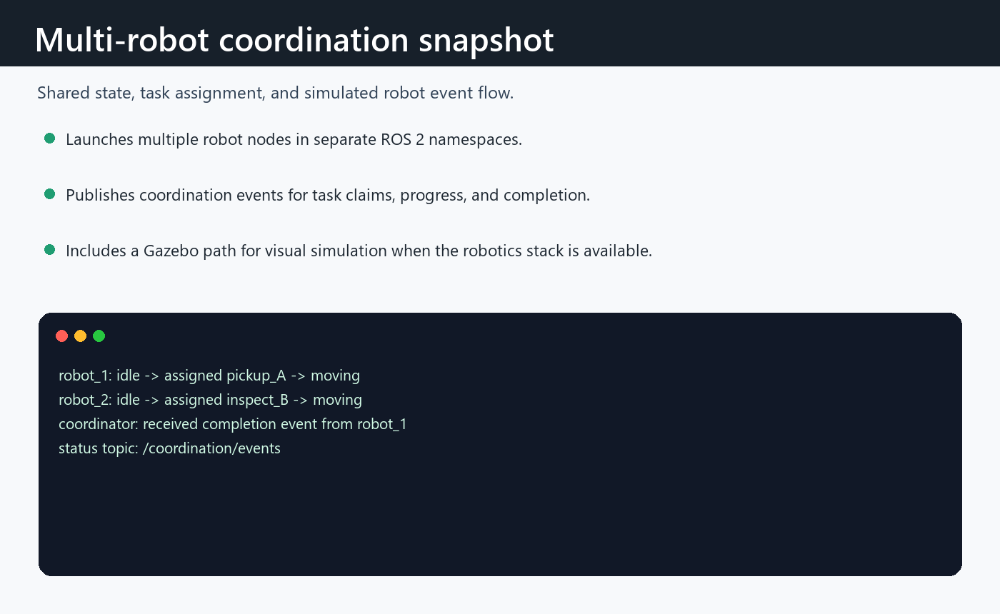

# ROS 2 Multi-Robot Coordination Mini Demo

A compact ROS 2 demo that coordinates multiple simulated robots with waypoint assignments, simple goal reservations, and namespaced robot topics.

The demo uses only standard ROS 2 message packages, so it is easy to build, inspect, and extend without creating custom interfaces first.

## Features

- Coordinator node assigns queued waypoint tasks to idle robots.
- Multiple robot agent nodes run in separate namespaces.
- Robot agents simulate simple 2D movement toward assigned goals.
- Goal reservation radius avoids assigning robots to conflicting targets.
- JSON payloads over `std_msgs/String` keep the package lightweight.
- Pure helper tests cover assignment payloads and reservation behavior.

## Project Layout

```text
.
├── config/
│   └── robots.yaml
├── launch/
│   └── demo.launch.py
├── multi_robot_coordination_demo/
│   ├── coordination.py
│   ├── coordinator_node.py
│   └── robot_agent_node.py
├── test/
│   └── test_coordination.py
├── package.xml
├── setup.cfg
└── setup.py
```

## Quick Start

Clone this repository into a ROS 2 workspace:

```bash
mkdir -p ~/ros2_ws/src
cd ~/ros2_ws/src
git clone https://github.com/KarimAmer45/ros2-multi-robot-coordination-demo.git
cd ~/ros2_ws
rosdep install --from-paths src --ignore-src -r -y
colcon build --packages-select multi_robot_coordination_demo
source install/setup.bash
ros2 launch multi_robot_coordination_demo demo.launch.py
```

Watch the coordination event stream in another terminal:

```bash
source ~/ros2_ws/install/setup.bash
ros2 topic echo /coordination/events
```

## Gazebo Sim Demo

This repository also includes an optional Gazebo Sim launch path. It uses modern `ros_gz_sim` and `ros_gz_bridge` instead of Gazebo Classic.

Install the ROS-Gazebo integration packages for your ROS 2 distribution:

```bash
sudo apt install ros-$ROS_DISTRO-ros-gz ros-$ROS_DISTRO-ros-gz-sim ros-$ROS_DISTRO-ros-gz-bridge
```

Then build and launch:

```bash
colcon build --packages-select multi_robot_coordination_demo
source install/setup.bash
ros2 launch multi_robot_coordination_demo gazebo_demo.launch.py
```

For older ROS 2 / Gazebo pairings whose bridge still uses `ignition.msgs`, launch with:

```bash
ros2 launch multi_robot_coordination_demo gazebo_demo.launch.py gz_msg_prefix:=ignition.msgs
```

The Gazebo launch starts:

- `worlds/coordination_arena.sdf`
- one `models/coordination_diffbot` instance per robot in `config/robots.yaml`
- the existing coordinator
- Gazebo-specific robot agents that follow assignments with `/model/<robot>/cmd_vel`
- ROS-Gazebo bridges for `/clock`, odometry, and velocity commands

See `docs/gazebo-simulation.md` for the integration details.

## Topics

Each robot is launched in its own namespace:

```text
/robot_1/assignment
/robot_1/pose
/robot_1/status
/robot_2/assignment
/robot_2/pose
/robot_2/status
```

The coordinator publishes:

```text
/coordination/events
```

## Customize The Scenario

Edit `config/robots.yaml` to change the robot fleet, starting poses, task queue, assignment period, or reservation radius.

You can also launch with a custom config file:

```bash
ros2 launch multi_robot_coordination_demo demo.launch.py config_file:=/absolute/path/to/robots.yaml
```

## Run Tests

```bash
colcon test --packages-select multi_robot_coordination_demo
colcon test-result --verbose
```

The included tests exercise pure Python coordination helpers, so they run quickly and do not need live ROS nodes.

## Next Steps

Good extensions for this mini demo:

- Replace JSON payloads with typed ROS 2 interfaces.
- Add Nav2 for map-aware multi-robot navigation.
- Add task priorities, cancellation, and charging behavior.

## Result screenshots



Coordination event flow for namespaced robot agents and task assignment.


## What this demonstrates

- Multiple ROS 2 robot agents running under separate namespaces.
- Coordinator-style task assignment with shared event/status topics.
- A Gazebo simulation path for showing robot state changes visually.


## Limitations and next steps

- The coordination policy is intentionally small and deterministic.
- No real fleet scheduler, map sharing, or collision-avoidance stack is included.
- Next steps: add task-allocation heuristics and recorded multi-robot simulation output.

